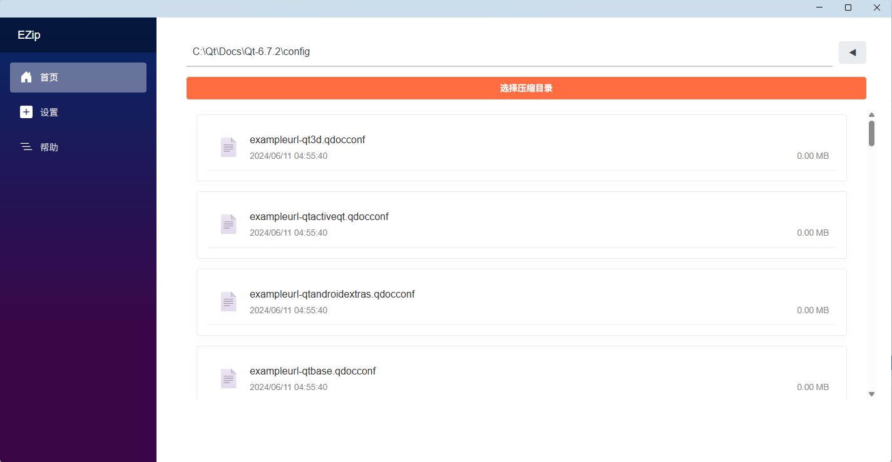
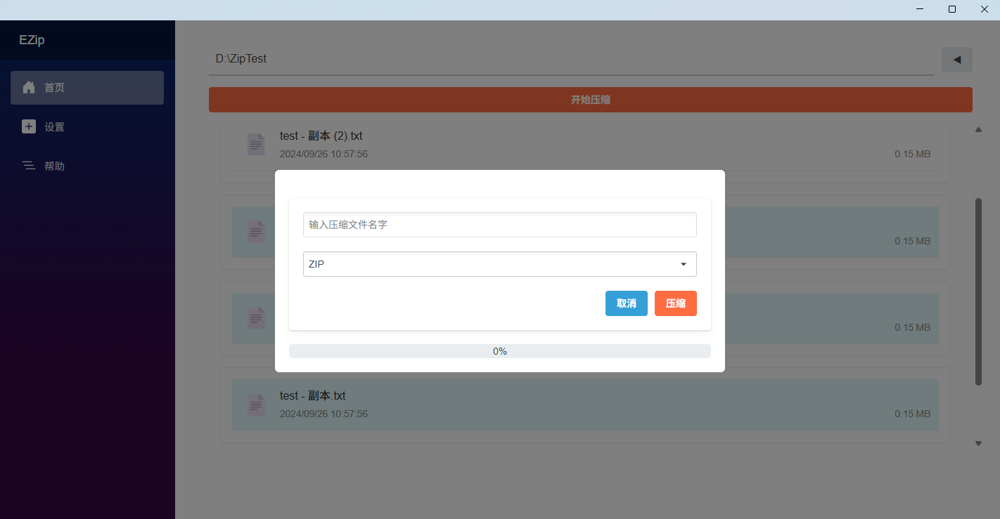

# EZip

**EZip** 是一个基于 **.NET MAUI Blazor** 开发的跨平台文件压缩与解压工具，支持 **Windows** 和 **Android**。  
本项目旨在提供一个简洁高效的工具，帮助用户轻松管理本地文件的压缩与解压任务。

---

## 📦 开发与运行

### 1. 克隆项目

```bash
git clone https://github.com/TheLengueE/EZip

运行环境:
Windows: Visual Studio 2022 + .NET 8 + MAUI
Android: 安装 Android SDK 并配置 MAUI
推荐使用 Visual Studio 进行开发与调试
---


## ✨ 功能特性

- 支持多种压缩格式：
  - ZIP
  - TAR
- 支持解压常见的压缩包文件,ZIP,TAR,7Z
- 支持文件和目录的批量压缩
- 支持中文路径和中文文件名（UTF-8 编码）
- 压缩/解压过程提供实时进度显示
- 响应式 UI：适配 Windows 和 Android（横屏/竖屏）

---

## 🖥️ 截图

> 以下截图为示例，实际界面可能有所不同：

- **主界面**
  

- **压缩进度条**
  

---

## 🔧 主要技术栈

- [.NET 8](https://dotnet.microsoft.com/) (MAUI Blazor)
- [Radzen.Blazor](https://blazor.radzen.com/) UI 组件库
- [SharpCompress](https://github.com/adamhathcock/sharpcompress) 文件压缩/解压库

---


